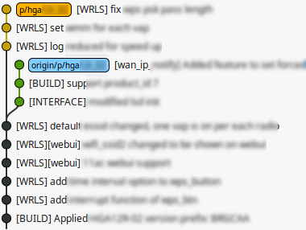
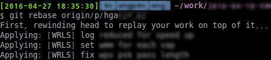
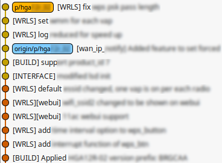

# how to manage diverged branch

동일 브랜치에서 두명이 작업하고 있다. 다른 개발자가 먼저 코드를 올렸다. 브랜치는 diverge 되었다.

브랜치를 diverge 하지 않고, 내 코드를 다른사람의 뒤에 올리고 싶다. 이 경우 remote 브랜치를 rebase를 하면 된다.

local 브랜치에서 remote 브랜치를 rebase하면, 내 커밋의 hash값이 변경되면서 remote의 HEAD 뒤에 붙는다.

diverge 된 브랜치가 정리되었다.

